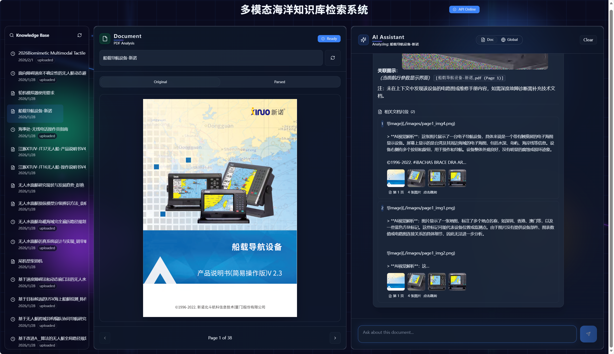

# Sea-RAG: 海洋装备智能维护与问答系统

**Sea-RAG** 是一个专为海洋装备（如无人艇、水下航行器等）维护场景设计的智能问答系统。它结合了最新的多模态大模型（Multimodal LLMs）与检索增强生成（RAG）技术，能够深度解析复杂的 PDF 技术文档（包含文本、表格、原理图），并提供基于证据的精准专业问答。

<p align="center">
  
</p>

## 🌟 核心特性

- **🖼️ 多模态 PDF 解析**: 集成 `Unstructured` 和视觉大模型 (VLM)，能够精准提取并理解 PDF 中的技术原理图、电路图和复杂表格。
- **👁️ 图文并茂的回答**: 系统在回答问题时，会自动检索并展示文档中的相关图片，辅助用户进行故障排查。
- **📚 知识库管理**: 支持批量上传技术手册，自动分块、向量化并构建索引。
- **🔍 精准引用溯源**: 每一个回答都标注了来源文档及页码，并支持一键跳转查看原文。
- **⚡ 现代化交互界面**: 基于 React 和 Vite 构建的流畅 Web 界面，支持流式对话 (Streaming) 和暗色模式。

## 🛠️ 技术栈

### 后端 (Backend)
- **Framework**: [FastAPI](https://fastapi.tiangolo.com/)
- **LLM Orchestration**: [LangChain](https://www.langchain.com/)
- **Vector Store**: [FAISS](https://github.com/facebookresearch/faiss)
- **PDF Processing**: [Unstructured](https://unstructured.io/), [PyMuPDF](https://pymupdf.readthedocs.io/)
- **Visual Understanding**: DeepSeek-VL / GPT-4o-Vision (via API)

### 前端 (Frontend)
- **Framework**: [React](https://react.dev/) + [Vite](https://vitejs.dev/)
- **Styling**: [TailwindCSS](https://tailwindcss.com/)
- **Components**: [Shadcn/UI](https://ui.shadcn.com/)
- **Visualization**: [Recharts](https://recharts.org/)

##  开发文档与日志 (Documentation)

本项目完整记录了从架构设计到功能落地的开发过程，您可以参考 `memery-bank/` 目录下的文档了解详情：

- **[架构设计文档 (Design Document)](memery-bank/design-document.md)**: 详细阐述了从单文档处理向全局知识库系统的演进路线。
- **[技术架构详解 (Technical Architecture)](memery-bank/tech-stack.md)**: 深入解析后端 PDF 处理流水线、RAG 引擎及前端交互实现。
- **[开发进度与变更日志 (Roadmap & Changelog)](memery-bank/progress.md)**: 记录各阶段的核心功能开发里程碑与版本变更。

## 🛠️ 环境准备 (Environment Setup)

### 1. 模型下载
为了提高加载速度并减少网络依赖，推荐提前下载以下模型到本地目录（例如 `sea-rag-backend/models/`）：
- **Embedding 模型**: `BAAI/bge-small-zh-v1.5`
  - 下载地址: [HuggingFace](https://huggingface.co/BAAI/bge-small-zh-v1.5)
- **下载脚本**: 可以直接运行项目提供的脚本进行自动下载：
  ```bash
  python scripts/download_models.py
  ```

### 2. 外部工具安装
本系统依赖以下外部工具进行 PDF 解析和 OCR：

- **Tesseract-OCR** (必须): 用于解析扫描版 PDF 或提取图片中的文字。
  - 下载: [Tesseract Wiki](https://github.com/UB-Mannheim/tesseract/wiki)
  - 安装后需将安装目录添加到系统 `PATH`，或者在 `.env` 中配置 `TESSERACT_PATH`。

- **Poppler** (必须): 用于 PDF 转图片。
  - 下载: [Poppler for Windows](https://github.com/oschwartz10612/poppler-windows/releases/)
  - 解压并将 `bin` 目录添加到系统 `PATH`，或者在 `.env` 中配置 `POPPLER_PATH`。

## 🚀 快速开始

### 1. 克隆项目
```bash
git clone https://github.com/your-username/sea-rag.git
cd sea-rag
```

### 2. 后端启动
进入后端目录并安装依赖：
```bash
cd sea-rag-backend

# 建议创建虚拟环境
python -m venv venv
# Windows:
.\venv\Scripts\activate
# Mac/Linux:
source venv/bin/activate

# 安装依赖
pip install -r requirements.txt
```

配置环境变量：
在 `sea-rag/` 根目录下创建 `.env` 文件（可复制 `.env.example`），并根据您的实际情况填写以下配置：

```ini
# --- 模型服务商 API Key (推荐 SiliconFlow / DeepSeek) ---
# 填写您的 API Key
OPENAI_API_KEY=sk-xxxxxxxxxxxxxxxx

# --- 本地工具路径 (必须配置) ---
# Tesseract OCR 安装路径 (请确保填写 tesseract.exe 的完整路径)
TESSERACT_PATH=C:\Program Files\Tesseract-OCR\tesseract.exe

# Poppler 解压路径 (填写 bin 目录的路径)
POPPLER_PATH=D:\tools\poppler\bin

# --- Embedding 模型配置 ---
# 推荐直接填写 HuggingFace Model ID (自动下载到缓存)：
EMBEDDING_MODEL_NAME=BAAI/bge-small-zh-v1.5

# (可选) 如果因网络原因需要手动下载，可使用 scripts/download_models.py 并配置绝对路径：
# EMBEDDING_MODEL_NAME=D:\Projects\sea-rag\sea-rag-backend\models\bge-small-zh-v1.5
```

启动服务：
```bash
# 确保在 sea-rag-backend 目录下
uvicorn app:app --reload --port 8000
# 服务启动后，可访问 http://127.0.0.1:8000/docs 查看 API 文档并进行功能测试
```

### 3. 前端启动
进入前端目录并安装依赖：
```bash
cd ../sea-rag-frontend

# 安装依赖
npm install

# 启动开发服务器
npm run dev
# 访问 http://localhost:5173
```

## 📂 项目结构

```
sea-rag/
├── sea-rag-backend/     # Python FastAPI 后端
│   ├── services/        # 核心业务逻辑 (PDF解析, 索引, RAG)
│   ├── tests/           # 单元测试与 Notebook
│   ├── app.py           # API 入口
│   ├── ingest_all.py    # 批量导入脚本 (新增)
│   └── requirements.txt # Python 依赖
├── sea-rag-frontend/    # React + Vite 前端
│   ├── src/             # 源代码
│   └── package.json     # Node 依赖
├── scripts/             # 工具脚本
└── data/                # (自动生成) 存放上传的 PDF 和索引文件
```

## 📚 知识库准备与批量导入 (Optional)

如果您有大量的 PDF 手册需要预先导入知识库，可以使用我们提供的批量处理工具。

**1. 获取 RAG 资源包 (示例数据)**
您可以使用以下百度网盘链接下载推荐的测试数据集，包含海洋装备相关的技术文档。
- **网盘链接**: [https://pan.baidu.com/s/1VaOLA0ePnCDSqEDSP0pELQ](https://pan.baidu.com/s/1VaOLA0ePnCDSqEDSP0pELQ)
- **提取码**: `1mv5`
- **文件名称**: `raw_pdf_ingestion` (解压后)

**2. 准备文件**
将下载或您自己的 PDF 文件放入后端目录下的 `raw_pdf_ingestion` 文件夹中：
`sea-rag-backend/raw_pdf_ingestion/*.pdf`

**3. 运行批量导入脚本**
此脚本会自动扫描目录、解析 PDF、提取图片并构建向量索引。

```bash
# 确保在 sea-rag-backend 目录下
cd sea-rag-backend

# 运行默认批量导入 (使用 hi_res 策略)
python ingest_all.py

# 常用参数：
# --force: 强制重新处理已存在的文件
# --strategy fast: 使用快速模式 (仅限纯文本 PDF，不推荐用于复杂手册)
python ingest_all.py --force
```

## 🧪 测试与验证 (Testing & Verification)

### 命令行测试
您可以直接通过命令行运行 Service 文件进行单元测试：

**1. 测试 PDF 解析 (`services/pdf_service.py`)**
执行 PDF -> Markdown 转换，并测试图片提取和 VLM 描述生成。
```bash
python sea-rag-backend/services/pdf_service.py --file_id test_001 --strategy hi_res
```

**2. 测试索引构建 (`services/index_service.py`)**
```bash
# 构建索引
python sea-rag-backend/services/index_service.py build --file_id test_001
# 搜索测试
python sea-rag-backend/services/index_service.py search --query "如何安装" --file_id test_001
```

**3. 测试 RAG 问答 (`services/rag_service.py`)**
```bash
python sea-rag-backend/services/rag_service.py --question "如何配置 Tesseract?" --file_id test_001
```

### Jupyter Notebook 测试
在 `sea-rag-backend/tests/` 目录下提供了详细的分步调试 Notebook：
1. `pdf_service.ipynb`: 测试 PDF 解析 (Unstructured)、图片提取和 OCR 功能。
2. `index_service.ipynb`: 测试索引构建、切片逻辑和向量搜索功能。
3. `rag_service.ipynb`: 测试完整的 RAG 检索生成流程。

**建议顺序**: 先运行 `pdf_service`，再 `index_service`，最后 `rag_service`。

## 🤝 贡献指南 (Contributing)

欢迎提交 Issue 和 Pull Request！

## 📄 许可证 (License)

本项目采用 **[CC BY-NC-ND 4.0 国际许可协议](https://creativecommons.org/licenses/by-nc-nd/4.0/deed.zh)** 进行许可。

您可以自由地：
- **分享** — 在任何媒介以任何形式复制、发行本作品。

但必须遵守以下条件：
- **署名 (Attribution)** — 您必须给出适当的署名，提供指向本许可协议的链接，同时标明是否（对原始作品）作了修改。
- **非商业性使用 (NonCommercial)** — 您不得将本作品用于商业目的。
- **禁止演绎 (NoDerivatives)** — 如果您再混合、转换或者基于本作品进行创作，您不得分发修改后的作品。

如需商业使用或对本项目进行修改并分发，请联系作者获取明确授权。

## 📚 参考与致谢 (Acknowledgements)

本项目基于 Bilibili 公开课教程进行二次开发与深度定制，感谢原作者提供的优质教学内容：

- **参考教程**: [【多模态PDF检索+图文并茂回复，企业级多模态RAG系统开发实战！】](https://www.bilibili.com/video/BV1CDHQzdEfg/?share_source=copy_web&vd_source=2ef7adfc171773d3b25a94de4f40ebb3)
- **教程内容**: 涵盖了 OCR 字符识别、VLM 图片语义识别及高性能多模态 RAG 系统的基础搭建思路。

在此基础上，本系统进行了大量工程化重构与功能扩展，包括但不限于：前端交互重构、全局知识库管理、流式引用溯源、批量数据处理验证等。
